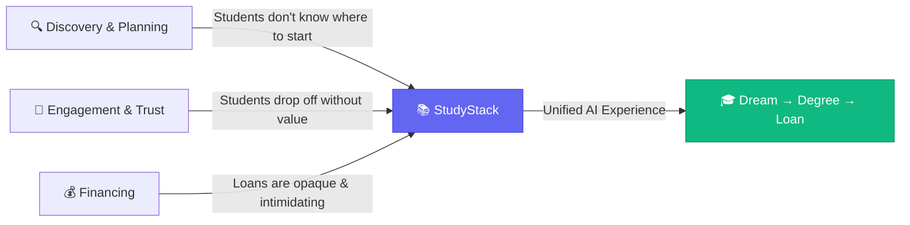
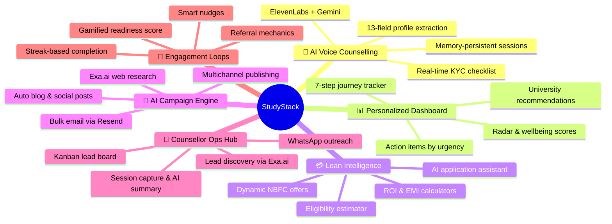
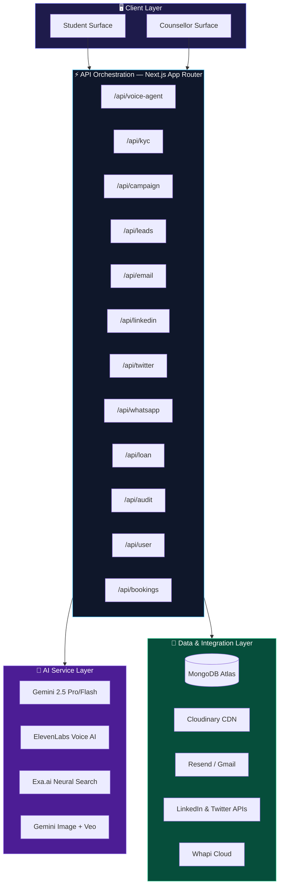
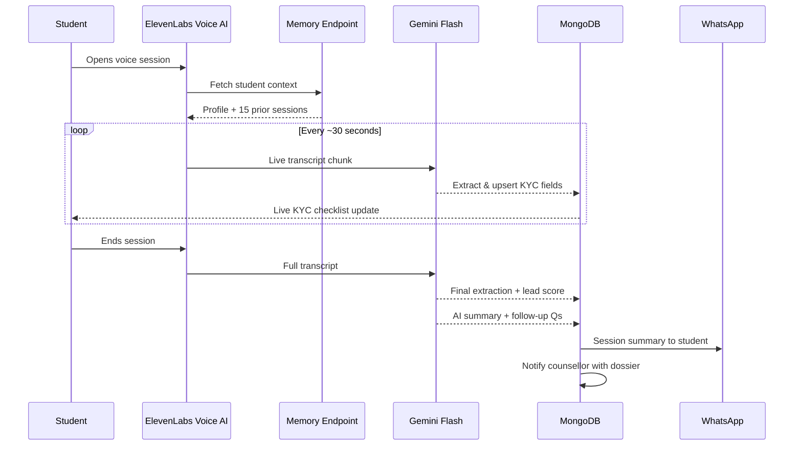
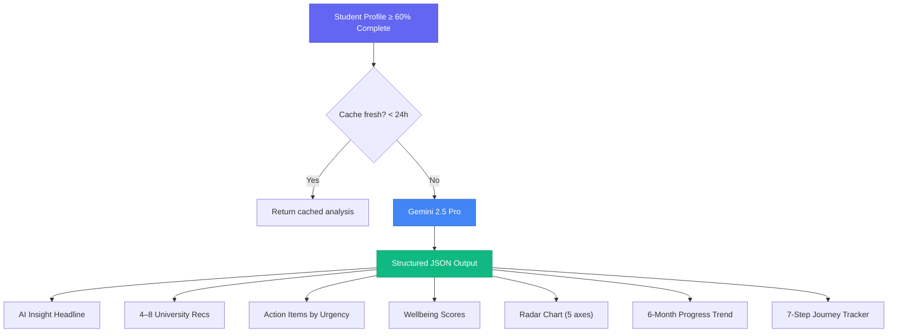
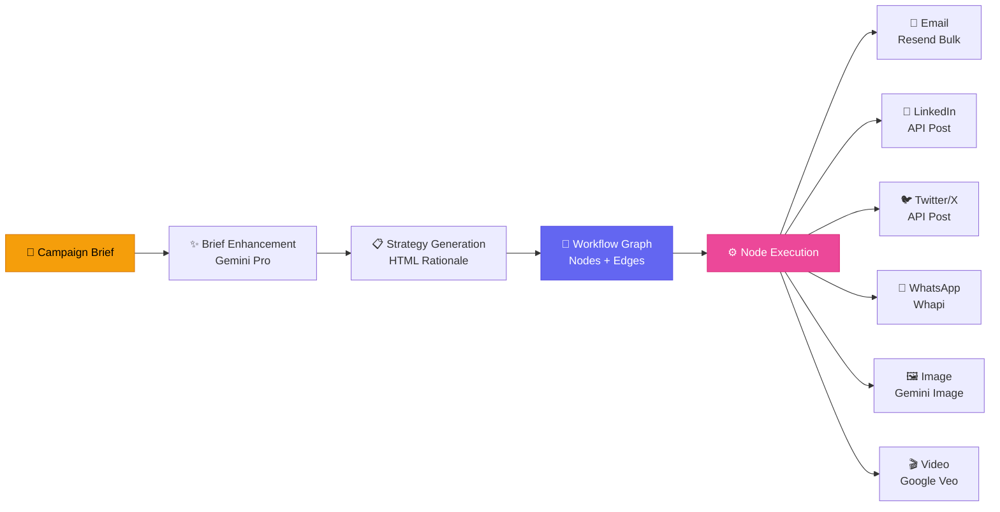
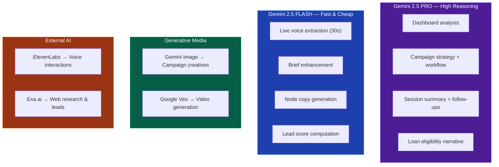
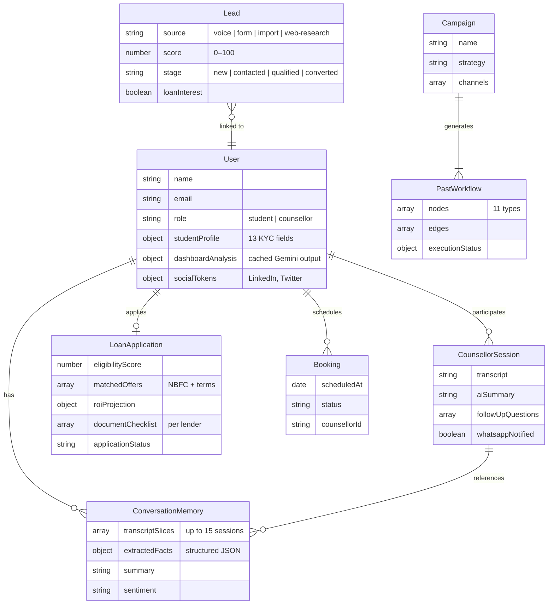
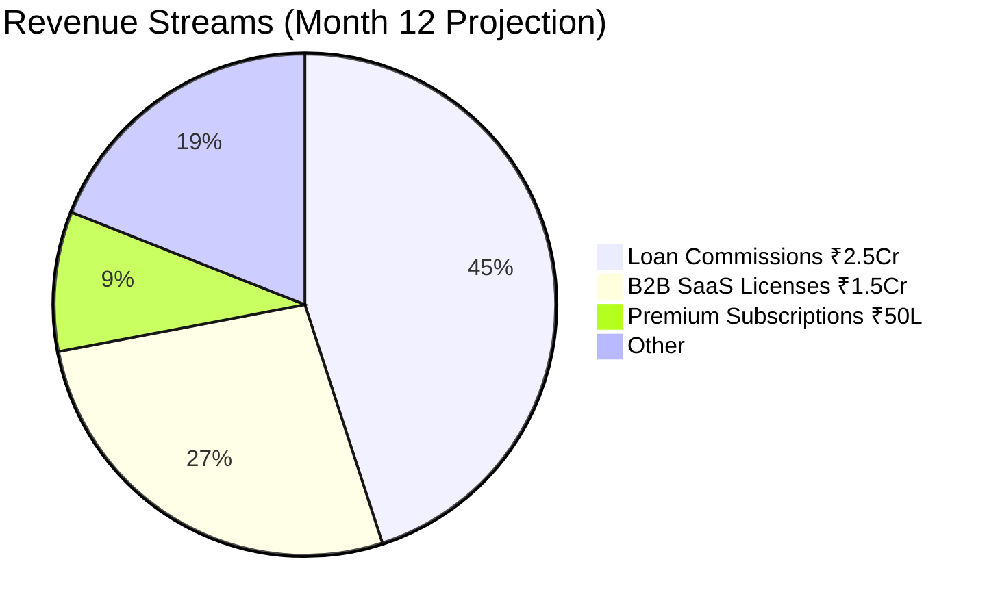

<p align="center">
  
  
  
  
  
  
</p>

<h1 align="center">📚 StudyStack</h1>
<h3 align="center"><em>Your AI Co-Pilot from Dream to Degree — and the Loan to Get There</em></h3>

<p align="center">
  An AI-native student engagement & education financing platform that replaces 10+ fragmented touchpoints with one intelligent ecosystem — from discovery to loan approval.
</p>

---

## 🧭 Table of Contents

- [Overview](#-overview)
- [Core Pillars](#-core-pillars)
- [System Architecture](#-system-architecture)
- [Tech Stack](#-tech-stack)
- [AI Architecture Deep Dive](#-ai-architecture-deep-dive)
- [User Journey](#-user-journey)
- [Data Models](#-data-models)
- [API Surface](#-api-surface)
- [Project Structure](#-project-structure)
- [Getting Started](#-getting-started)
- [Environment Variables](#-environment-variables)
- [Business Model](#-business-model)

---

## 🚀 Overview

StudyStack is a full-stack, AI-native platform built for Indian students planning postgraduate education — abroad (US, UK, Canada, Europe, Australia) or domestically (IIMs, ISB, top private universities).

It sits at the intersection of three underserved spaces:



**Key differentiators:**
- **Voice-first profiling** via ElevenLabs — no forms, just conversation
- **Agentic marketing** — AI autonomously creates & publishes outreach content
- **Loan-native UX** — financing woven into the student journey, not bolted on
- **Memory across sessions** — the platform remembers every conversation & preference

---

## 🏛️ Core Pillars



---

## 🏗️ System Architecture



---

## 🛠️ Tech Stack

| Layer | Technology | Purpose |
|:------|:-----------|:--------|
| **Frontend** | Next.js 16, React 19, Tailwind CSS v4 | App shell, SSR, routing |
| **UI / UX** | Framer Motion, ReactFlow, Recharts, Three.js, GSAP | Animations, DAG canvas, charts, 3D, scroll effects |
| **State** | Zustand | Client-side state management |
| **Backend** | Next.js API Routes (TypeScript + JS) | All server-side logic |
| **Database** | MongoDB Atlas + Mongoose 9 | Persistent data |
| **Auth** | NextAuth 4.24 (JWT + Google OAuth) | Session management, RBAC |
| **Validation** | Zod 4 | Input schema enforcement |
| **AI — Reasoning** | Google Gemini 2.5 Pro / Flash | Dashboard, extraction, strategy, copy |
| **AI — Voice** | ElevenLabs Conversational AI | Live voice counselling |
| **AI — Images** | Gemini Image Model | Campaign creative generation |
| **AI — Video** | Google Veo (GenAI) | Video concept + generation |
| **AI — Research** | Exa.ai (Neural Web Search) | Grounded content, lead discovery |
| **Email** | Resend + Nodemailer (Gmail fallback) | Transactional + bulk email |
| **Social** | LinkedIn API, Twitter/X API v2 | Organic posting |
| **WhatsApp** | Whapi Cloud | Follow-ups, booking confirmations |
| **Media** | Cloudinary | Image hosting + CDN |
| **PDF** | jsPDF, pdf-parse, Tesseract.js | PDF generation, parsing, OCR |
| **Observability** | MongoDB AuditLog + JSONL agent logs | Full audit trail |

---

## 🧠 AI Architecture Deep Dive

### Voice Counselling Flow



### Dashboard Analysis Flow



### Agentic Campaign Workflow (DAG Execution)



### AI Model Strategy



---

## 🗺️ User Journey

```mermaid
journey
    title Student Journey on StudyStack
    section Awareness
      See AI content on LinkedIn or Twitter: 3
    section Acquisition
      Landing page and Google OAuth signup: 5
    section Activation
      Voice Agent profile call: 5
      Dashboard unlocks: 4
    section Engagement
      Daily dashboard updates and nudges: 4
      Journey tracker progress: 4
    section Loan Discovery
      Loan intelligence activates at 70 pct: 5
      Eligibility check and personalized offers: 5
    section Conversion
      AI document checklist and lender app: 5
    section Retention
      Post-loan journey tracker and referral: 4
```

---

## 📦 Data Models



---

## 🔌 API Surface

The platform exposes **22 API route groups** under `/api/`:

| Route Group | Key Endpoints | Purpose |
|:------------|:-------------|:--------|
| `voice-agent` | `memory`, `live-extract`, `end-session`, `anam-session` | Voice counselling lifecycle |
| `kyc` | Profile extraction & validation | Student KYC management |
| `user` | `dashboard-analysis`, profile CRUD | User data & AI dashboard |
| `loan` | Eligibility, offers, ROI, EMI, application | Loan intelligence layer |
| `campaign` | Brief, strategy, workflow execution | Agentic campaign engine |
| `leads` | Scoring, import, Kanban management | Lead management |
| `email` | Single & bulk send via Resend | Email outreach |
| `linkedin` | OAuth, post creation | LinkedIn integration |
| `twitter` | OAuth, tweet posting | Twitter/X integration |
| `whatsapp` | Send, poll, schedule | WhatsApp automation |
| `counsellor` | Session mgmt, assignment | Counsellor operations |
| `counsellor-sessions` | Capture, transcript, summary | Session intelligence |
| `bookings` | Schedule, manage | Appointment scheduling |
| `audit` | Logs, agent observability | Audit trail & monitoring |
| `workflows` | DAG save, load, execute | Campaign workflow persistence |
| `video-studio` | Veo generation pipeline | AI video creation |
| `cloudinary` | Upload, transform | Media management |
| `students` | Student listing & search | Student directory |

---

## 📁 Project Structure

```
StudyStack/
├── app/
│   ├── api/                    # 22 API route groups
│   │   ├── voice-agent/        # ElevenLabs + memory + extraction
│   │   ├── loan/               # Loan intelligence endpoints
│   │   ├── campaign/           # Agentic campaign engine
│   │   ├── leads/              # Lead scoring & management
│   │   ├── email/              # Resend integration
│   │   ├── linkedin/           # LinkedIn API
│   │   ├── twitter/            # Twitter/X API
│   │   ├── whatsapp/           # Whapi Cloud
│   │   └── ...                 # audit, bookings, user, etc.
│   ├── dashboard/              # Student & counsellor dashboards
│   │   ├── complete/           # Full analysis view
│   │   ├── counsellor/         # Counsellor operations hub
│   │   └── loan/               # Loan intelligence UI
│   ├── campaign/               # Campaign builder (DAG canvas)
│   ├── onboarding/             # Voice onboarding flow
│   ├── profile/                # User profile management
│   ├── merkle/                 # Merkle tree visualization
│   ├── audit/                  # Audit log viewer
│   ├── login/                  # Auth pages
│   └── page.js                 # Landing page (28KB of premium UI)
├── components/
│   ├── AnamVoiceAgent.jsx      # Voice agent component
│   ├── ElevenLabsVoiceAgent.jsx # ElevenLabs integration
│   ├── AICounsellingDashboard.jsx # 53KB dashboard component
│   ├── JourneyPath.jsx         # 7-step journey visualization
│   ├── LiveKYCChecklist.jsx    # Real-time KYC tracker
│   ├── StudentProfileCard.jsx  # Profile card with scores
│   ├── LiquidEther.jsx         # 3D background (Three.js)
│   ├── LaserFlow.jsx           # Animated flow visualization
│   ├── StaggeredMenu.jsx       # Animated navigation
│   ├── MerkleTreeVisualization.jsx # Data integrity viz
│   ├── campaign/               # Campaign-specific components
│   └── ui/                     # Radix UI primitives
├── lib/
│   ├── models/                 # 15 Mongoose models
│   ├── loan/                   # Loan calculation engine
│   ├── validations/            # Zod schemas
│   ├── whatsapp/               # WhatsApp helpers
│   ├── gemini.ts               # Gemini API client
│   ├── cloudinary.ts           # Cloudinary integration
│   ├── execution-engine.ts     # Campaign DAG executor
│   ├── audit-logger.ts         # Audit logging system
│   ├── agent-observability.ts  # AI agent monitoring
│   └── store.ts                # Zustand state store
└── public/                     # Static assets
```

---

## ⚡ Getting Started

### Prerequisites

- **Node.js** ≥ 18.x
- **MongoDB Atlas** cluster (or local MongoDB)
- API keys: Google Gemini, ElevenLabs, Exa.ai, Resend, Cloudinary

### Installation

```bash
# Clone the repository
git clone https://github.com/your-username/StudyStack.git
cd StudyStack/StudyStack

# Install dependencies
npm install

# Set up environment variables
cp .env.example .env
# Fill in your API keys (see Environment Variables section)

# Run the development server
npm run dev
```

The app will be available at `http://localhost:3000`.

---

## 🔐 Environment Variables

Create a `.env` file in the `StudyStack/` directory:

```env
# Database
MONGODB_URI=mongodb+srv://...

# Auth
NEXTAUTH_SECRET=your-secret
NEXTAUTH_URL=http://localhost:3000
GOOGLE_CLIENT_ID=...
GOOGLE_CLIENT_SECRET=...

# AI Services
GEMINI_API_KEY=...
ELEVENLABS_API_KEY=...
EXA_API_KEY=...

# Email
RESEND_API_KEY=...

# Social
LINKEDIN_CLIENT_ID=...
LINKEDIN_CLIENT_SECRET=...
TWITTER_API_KEY=...
TWITTER_API_SECRET=...

# WhatsApp
WHAPI_TOKEN=...

# Media
CLOUDINARY_CLOUD_NAME=...
CLOUDINARY_API_KEY=...
CLOUDINARY_API_SECRET=...
```

---

## 💼 Business Model



| Stream | Model | Month 12 Target |
|:-------|:------|:----------------|
| **Loan Referral** | 0.5–1.5% of loan value per NBFC referral | ₹2.5 Cr/mo |
| **B2B SaaS** | ₹15K–50K/mo per agency seat | ₹1.5 Cr/mo |
| **Premium Sub** | ₹999/mo or ₹4,999 one-time | ₹50L/mo |

**Growth Trajectory:**

| Metric | Month 6 | Month 12 | Month 24 |
|:-------|:--------|:---------|:---------|
| Registered Users | 50K | 200K | 800K |
| Monthly Active Users | 15K | 80K | 300K |
| Loan Referrals/mo | 50 | 500 | 3,000 |
| **Total MRR** | **₹50L** | **₹4.5 Cr** | **₹28 Cr** |

---

<p align="center">
  <strong>StudyStack</strong> · Next.js 16 · React 19 · Gemini 2.5 · ElevenLabs · Exa.ai · MongoDB
  <br/>
  <em>Built with ❤️ for Indian students chasing their dreams</em>
</p>
