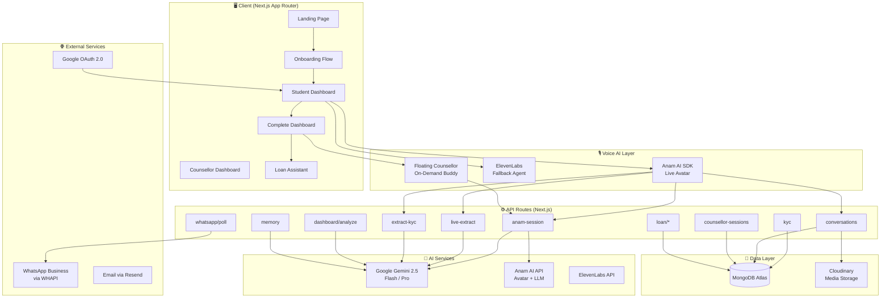
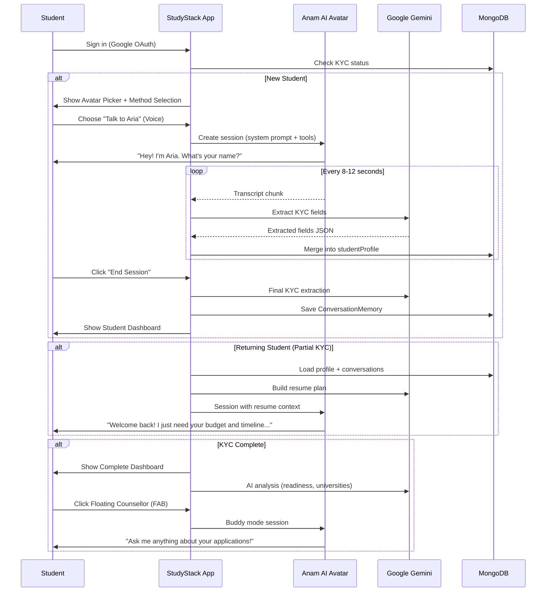
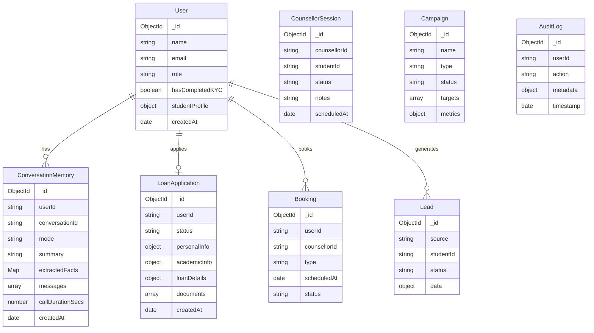
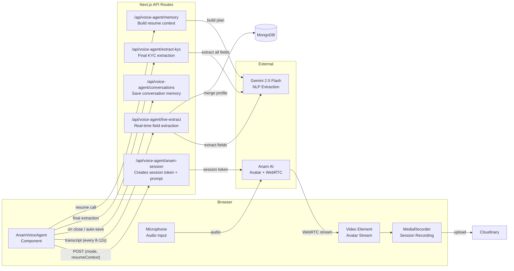
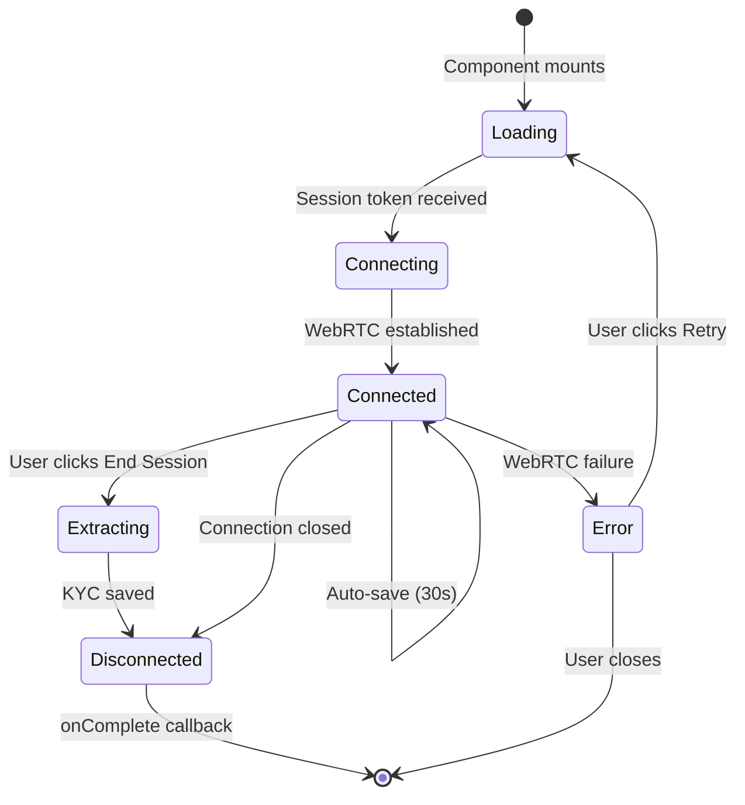
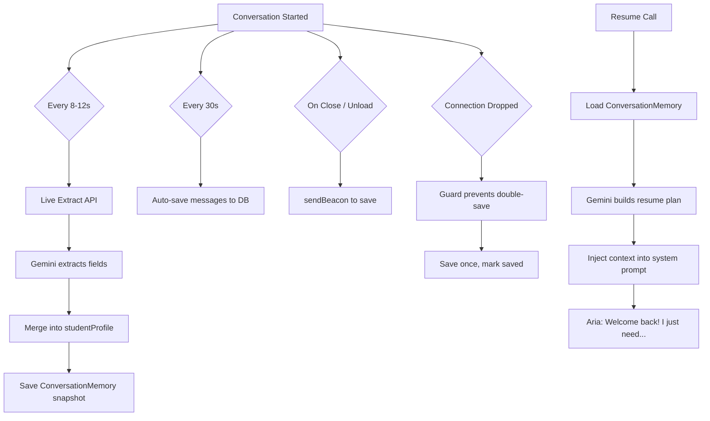
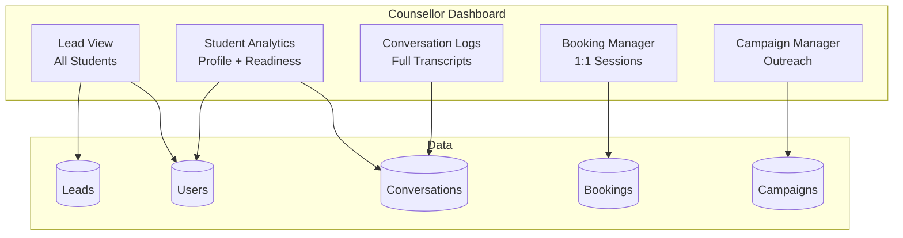
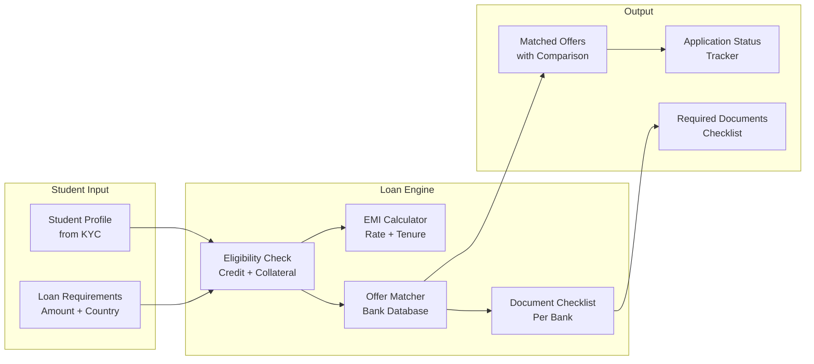
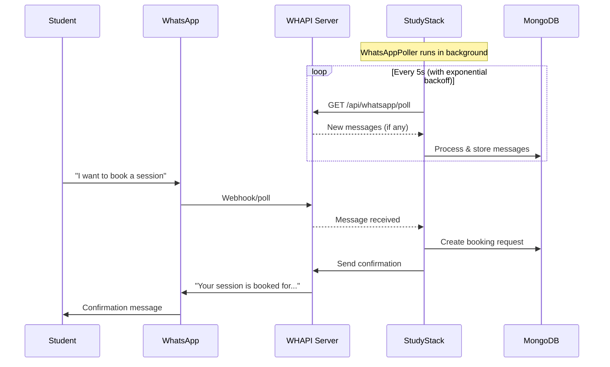

# 📚 StudyStack — AI-Powered Study Abroad Platform

> **An end-to-end AI counselling platform for overseas education**, combining real-time voice AI avatars, automated KYC extraction, intelligent loan matching, WhatsApp integration, and a full counsellor CRM — built on Next.js 16, MongoDB, Anam AI, Google Gemini, and ElevenLabs.

---

## 🏗️ Architecture Overview



---

## 🧩 System Flow — Student Journey



---

## 📋 Feature Matrix

### 👨‍🎓 Student Features

| Feature | Description | Tech |
|---------|-------------|------|
| **Google OAuth Login** | One-click sign-in via Google | NextAuth.js + Google Provider |
| **Avatar Picker** | Choose a superhero avatar guide (Hulk, Iron Man, Thor, Spider-Man) | Custom React component |
| **AI Voice Onboarding** | Aria (AI avatar) conducts a natural voice conversation to collect 13 KYC fields | Anam AI SDK + Gemini |
| **Multilingual Support** | Automatically detects Hindi, Marathi, Tamil, Kannada, Urdu and switches | Anam `change_language` tool |
| **Live KYC Extraction** | Fields are extracted in real-time every 8–12 seconds during conversation | Gemini 2.5 Flash |
| **Session Resume** | If interrupted, the AI picks up exactly where you left off, no re-asking | ConversationMemory + Gemini resume planner |
| **Periodic Auto-Save** | Conversation messages saved every 30 seconds automatically | Auto-save interval + sendBeacon |
| **Complete Dashboard** | Rich analytics: readiness score, radar chart, budget breakdown, AI wellbeing | Recharts + Gemini Pro analysis |
| **University Matching** | AI-powered university recommendations with match scores | Gemini web search + grounding |
| **Journey Path** | Visual step-by-step path: Test → Apply → Visa → Travel | Dynamic steps from Gemini |
| **Floating Counsellor** | Always-available "Talk to Aria" FAB for on-demand counselling | FloatingCounsellor + buddy mode |
| **Loan Assistant** | Education loan eligibility, EMI calculator, offer comparison, document checklist | Custom loan engine |
| **WhatsApp Booking** | Schedule 1:1 counselling sessions via WhatsApp | WHAPI integration |
| **Session Recording** | Voice sessions are recorded and stored for playback | MediaRecorder + Cloudinary |

### 👩‍💼 Counsellor Features

| Feature | Description | Tech |
|---------|-------------|------|
| **Counsellor Dashboard** | Full CRM view of all student leads | Custom React dashboard |
| **Student Analytics** | Profile completeness, readiness scores, conversation history | Gemini analysis API |
| **Session Logs** | Browse all past voice conversations with transcripts | ConversationMemory model |
| **Lead Management** | Track, filter, and prioritize student leads | Lead model + API |
| **Campaign Manager** | Create and manage outreach campaigns | Campaign model + workflows |
| **Booking Calendar** | View and manage 1:1 session bookings | Booking model |
| **WhatsApp Integration** | Receive and respond to student messages | WHAPI polling |

### 🛡️ Platform Features

| Feature | Description | Tech |
|---------|-------------|------|
| **Audit Logging** | Every significant action is logged with timestamps | AuditLog model |
| **Agent Observability** | Track AI agent performance, latency, token usage | Custom observability lib |
| **Role-Based Access** | Student vs Counsellor views with proper authorization | NextAuth roles |
| **Dark/Light Mode** | Full theme support with system preference detection | next-themes |
| **Responsive Design** | Mobile-first, works on all screen sizes | Tailwind CSS v4 |
| **3D Landing Page** | Immersive landing with Three.js + GSAP animations | React Three Fiber |

---

## 🗄️ Database Schema



---

## 🎙️ Voice AI Architecture



### Voice Session Lifecycle



---

## 📁 Project Structure

```
StudyStack/
├── app/
│   ├── api/
│   │   ├── auth/[...nextauth]/     # Google OAuth handler
│   │   ├── kyc/                     # KYC CRUD (GET/POST/PUT)
│   │   ├── voice-agent/
│   │   │   ├── anam-session/        # Create Anam session + build prompt
│   │   │   ├── live-extract/        # Real-time transcript → field extraction
│   │   │   ├── extract-kyc/         # Final KYC extraction on session end
│   │   │   ├── conversations/       # Save/load conversation memories
│   │   │   ├── memory/              # Build context + resume plan
│   │   │   ├── recordings/          # Upload session recordings
│   │   │   ├── end-session/         # Graceful session teardown
│   │   │   ├── elevenlabs-token/    # ElevenLabs signed URL (fallback)
│   │   │   └── submit-kyc-elevenlabs/ # Legacy ElevenLabs KYC endpoint
│   │   ├── dashboard/analyze/       # Gemini-powered dashboard analysis
│   │   ├── loan/                    # Loan eligibility, EMI, offers, documents
│   │   ├── counsellor/              # Counsellor management APIs
│   │   ├── counsellor-sessions/     # Session scheduling & management
│   │   ├── bookings/                # Booking CRUD
│   │   ├── leads/                   # Lead management
│   │   ├── campaign/                # Campaign CRUD + analytics
│   │   ├── whatsapp/poll/           # WhatsApp message polling
│   │   ├── email/                   # Email sending via Resend
│   │   ├── students/                # Student management APIs
│   │   ├── audit/                   # Audit log APIs
│   │   └── cloudinary/              # Media upload/management
│   ├── dashboard/
│   │   ├── page.js                  # Student dashboard (KYC in-progress)
│   │   ├── layout.js                # Dashboard layout + nav + poller
│   │   ├── complete/
│   │   │   ├── page.js              # Complete dashboard (post-KYC analytics)
│   │   │   └── counsellor-session/  # Full-screen counsellor session page
│   │   ├── counsellor/
│   │   │   ├── page.js              # Counsellor CRM dashboard
│   │   │   ├── logs/                # Conversation logs viewer
│   │   │   └── components/          # Counsellor-specific components
│   │   └── loan/                    # Loan application pages
│   ├── onboarding/                  # Manual onboarding form (alternative)
│   ├── login/                       # Login page
│   ├── auth/                        # Auth pages
│   ├── campaign/                    # Campaign pages
│   ├── merkle/                      # Merkle tree visualization (data integrity)
│   ├── audit/                       # Audit log viewer
│   ├── profile/                     # User profile page
│   ├── page.js                      # Landing page (3D + animations)
│   └── layout.js                    # Root layout
├── components/
│   ├── AnamVoiceAgent.jsx           # Core voice agent (Anam AI integration)
│   ├── ElevenLabsVoiceAgent.jsx     # Fallback voice agent (ElevenLabs)
│   ├── FloatingCounsellor.jsx       # On-demand FAB counsellor button
│   ├── LiveKYCChecklist.jsx         # Real-time KYC progress checklist
│   ├── AICounsellingDashboard.jsx   # Counsellor analytics dashboard
│   ├── StudentProfileCard.jsx       # Student profile display card
│   ├── CounsellingSidebarCard.jsx   # Counselling progress sidebar
│   ├── JourneyPath.jsx              # Visual study abroad journey path
│   ├── WhatsAppPoller.jsx           # Background WhatsApp message poller
│   ├── WhatsAppScheduleCard.jsx     # WhatsApp 1:1 booking card
│   ├── StaggeredMenu.jsx            # Animated sidebar navigation
│   ├── ModelViewer.jsx              # 3D model viewer (Three.js)
│   ├── LiquidEther.jsx              # Liquid animation effects
│   ├── LaserFlow.jsx                # Laser particle effects
│   ├── MerkleTreeVisualization.jsx  # Merkle tree data integrity UI
│   └── ui/                          # Reusable UI primitives (shadcn)
├── lib/
│   ├── counselling-profile.js       # Field definitions, normalization, merging
│   ├── mongodb.js                   # MongoDB connection singleton
│   ├── models/                      # Mongoose schema definitions
│   │   ├── User.js
│   │   ├── ConversationMemory.js
│   │   ├── LoanApplication.ts
│   │   ├── CounsellorSession.js
│   │   ├── Booking.js
│   │   ├── Lead.js
│   │   ├── Campaign.js
│   │   ├── AuditLog.js
│   │   └── ...
│   ├── gemini.ts                    # Gemini AI client wrapper
│   ├── cloudinary.ts                # Cloudinary upload utilities
│   ├── agent-observability.ts       # AI agent performance tracking
│   ├── audit-logger.ts              # Audit logging utilities
│   ├── execution-engine.ts          # Workflow execution engine
│   ├── loan/                        # Loan calculation logic
│   ├── whatsapp/                    # WhatsApp message handling
│   └── validations/                 # Zod validation schemas
└── public/                          # Static assets (avatars, images)
```

---

## 🔑 Environment Variables

| Variable | Required | Description |
|----------|----------|-------------|
| `MONGODB_URI` | ✅ | MongoDB Atlas connection string |
| `NEXTAUTH_SECRET` | ✅ | NextAuth.js session encryption key |
| `NEXTAUTH_URL` | ✅ | Application URL (e.g. `http://localhost:3000`) |
| `GOOGLE_CLIENT_ID` | ✅ | Google OAuth client ID |
| `GOOGLE_CLIENT_SECRET` | ✅ | Google OAuth client secret |
| `ANAM_AI_API_KEY` | ✅ | Anam AI API key for avatar sessions |
| `GEMINI_API_KEY` | ✅ | Google Gemini API key for NLP |
| `ELEVENLABS_API_KEY` | ⚠️ | ElevenLabs API key (fallback voice agent) |
| `ELEVENLABS_AGENT_ID` | ⚠️ | ElevenLabs agent ID (fallback) |
| `WHAPI_TOKEN` | ⬡ | WHAPI token for WhatsApp integration |
| `CLOUDINARY_CLOUD_NAME` | ⬡ | Cloudinary cloud name |
| `CLOUDINARY_API_KEY` | ⬡ | Cloudinary API key |
| `CLOUDINARY_API_SECRET` | ⬡ | Cloudinary API secret |
| `RESEND_API_KEY` | ⬡ | Resend API key for emails |

> ✅ = Required | ⚠️ = Recommended | ⬡ = Optional

---

## 🚀 Getting Started

### Prerequisites
- Node.js 18+
- MongoDB Atlas cluster (free tier works)
- Google Cloud Console project with OAuth 2.0 credentials
- Anam AI account and API key
- Google Gemini API key

### Installation

```bash
# Clone the repository
git clone https://github.com/your-org/StudyStack.git
cd StudyStack

# Install dependencies
npm install

# Copy environment template and fill in your values
cp .env.example .env

# Run development server
npm run dev
```

The app will be available at `http://localhost:3000`.

### First-Time Setup

1. **MongoDB Atlas**: Create a cluster, whitelist your IP, create a database user
2. **Google OAuth**: Create credentials in Google Cloud Console, add `http://localhost:3000/api/auth/callback/google` as authorized redirect URI
3. **Anam AI**: Sign up at [anam.ai](https://anam.ai), get your API key
4. **Gemini**: Get API key from [Google AI Studio](https://aistudio.google.com)

---

## 🎯 Key Technical Decisions

### Why Anam AI over ElevenLabs?
- **Visual Avatar**: Anam provides a real-time rendered avatar that speaks, creating a more engaging counselling experience
- **WebRTC Streaming**: Lower latency than REST-based TTS/STT
- **System Tools**: Built-in language switching (`change_language`) for multilingual students
- **Custom LLM Routing**: Supports injecting system prompts with full student context

### Why Gemini for Extraction?
- **Structured Output**: Gemini 2.5 Flash excels at extracting structured data (JSON) from conversational text
- **Speed**: Flash variant processes transcripts in 1-3 seconds, suitable for live extraction
- **Multilingual**: Handles Hindi, Marathi, Hinglish natively without translation
- **Web Grounding**: Gemini Pro with search for university recommendations

### Session Persistence Strategy


---

## 🏛️ Counsellor CRM Architecture



---

## 💰 Loan Assistant Architecture



### Loan API Endpoints

| Endpoint | Method | Description |
|----------|--------|-------------|
| `/api/loan/eligibility` | POST | Check loan eligibility based on profile |
| `/api/loan/emi` | POST | Calculate EMI for given loan parameters |
| `/api/loan/offers` | GET | Get matched loan offers |
| `/api/loan/search-offers` | POST | Search and filter loan offers |
| `/api/loan/document-checklist` | GET | Get required documents per lender |
| `/api/loan/application-status` | GET/PUT | Track application progress |
| `/api/loan/roi` | POST | Calculate return on investment |

---

## 🔄 WhatsApp Integration Flow



---

## 📊 Dashboard Analytics (Gemini-Powered)

The complete dashboard uses **Gemini 2.5 Pro** to generate personalized analysis:

| Analysis | Description |
|----------|-------------|
| **Readiness Score** | Weighted composite score (0-100) across academics, language, finances, clarity, timeline |
| **Radar Chart** | 5-axis profile strength visualization |
| **University Matches** | Real universities found via Gemini web search with match % |
| **Wellbeing Scores** | AI-assessed focus, confidence, and stress levels |
| **Budget Breakdown** | Estimated tuition, living, travel, misc allocation |
| **Progress Trend** | Month-over-month readiness improvement chart |
| **Personalized Recommendations** | Categorized action items (academic, test, financial, documents, visa) |
| **Journey Steps** | Dynamic study abroad roadmap based on missing profile gaps |
| **Session Suggestions** | Recommended follow-up counselling topics |

---

## 🛡️ Security & Data Integrity

- **Authentication**: Google OAuth 2.0 via NextAuth.js with JWT sessions
- **Authorization**: Role-based access (student / counsellor) enforced server-side
- **Data Validation**: Zod schemas for all API inputs
- **Audit Trail**: Every significant action logged with userId, timestamp, and metadata
- **Merkle Tree**: Data integrity verification for critical records
- **Session Tokens**: Anam AI session tokens are short-lived and server-generated
- **CORS**: API routes are same-origin only
- **Environment Isolation**: All secrets stored in `.env`, never exposed to client

---

## 🧪 KYC Field Extraction Pipeline

The 13 counselling fields extracted through voice conversation:

| # | Field | Key | Example |
|---|-------|-----|---------|
| 1 | Student Name | `studentName` | "Priya Sharma" |
| 2 | Phone Number | `phoneNumber` | "+91 98765 43210" |
| 3 | Email | `contactEmail` | "priya@gmail.com" |
| 4 | Location | `currentLocation` | "Mumbai, Maharashtra" |
| 5 | Education Level | `educationLevel` | "Bachelor's" |
| 6 | Field of Study | `fieldOfStudy` | "Computer Science" |
| 7 | Institution | `institution` | "Mumbai University" |
| 8 | GPA / Percentage | `gpaPercentage` | "8.1 CGPA" |
| 9 | Target Countries | `targetCountries` | ["UK", "Ireland"] |
| 10 | Course Interest | `courseInterest` | "MSc Data Science" |
| 11 | English Test Status | `englishTestStatus` | "IELTS preparing" |
| 12 | Budget Range | `budgetRange` | "₹20-30 Lakhs" |
| 13 | Application Timeline | `applicationTimeline` | "Within 3 months" |

### Extraction Rules
- **Phone numbers**: Supports Hindi word-to-digit conversion ("double nine" → "99", "paanch" → "5")
- **Email**: Validated with regex, lowercased
- **Arrays**: Target countries split on commas/semicolons and deduplicated
- **Merge Logic**: New values only replace old values if they're more specific (calculated via specificity score)
- **Placeholder Detection**: Values like "not sure", "N/A", "pending" are treated as empty

---

## 🏃 Development

```bash
# Development
npm run dev

# Production build
npm run build
npm start

# Linting
npm run lint
```

### Tech Stack Summary

| Layer | Technology | Version |
|-------|-----------|---------|
| Framework | Next.js (App Router) | 16.x |
| UI | React + Tailwind CSS | 19.x / 4.x |
| Database | MongoDB + Mongoose | Atlas / 9.x |
| Auth | NextAuth.js | 4.x |
| Voice AI | Anam AI JS SDK | 4.13+ |
| Fallback Voice | ElevenLabs React | 1.x |
| NLP / LLM | Google Gemini | 2.5 Flash/Pro |
| 3D Graphics | Three.js + React Three Fiber | 0.180 |
| Animations | Framer Motion + GSAP | 12.x / 3.x |
| Charts | Recharts | 2.x |
| Media | Cloudinary | 2.x |
| Email | Resend | 4.x |
| WhatsApp | WHAPI | REST API |
| State | Zustand | 5.x |
| Validation | Zod | 4.x |

---

## 📝 License

This project is private and proprietary. All rights reserved.

---

<p align="center">
  Built with ❤️ by the StudyStack team
</p>
